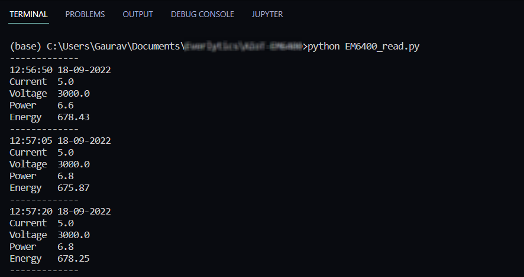

# Schneider EM6400 Digital Meter
The EM6400 series power meters are digital power meters that offer
comprehensive electrical instrumentation and load management
facilities in a compact and rugged package.

This Repository contains the Python Script that can fetch these electrical data like *voltage, current, power, energy consumption* etc. from EM6400.

EM6400 sends out the data using Modbus RTU protocol and hence necessary libraries are been included which supports Modbus RTU mainly **pymodbus**.

## Necessary Instructions
- Install all the required libraries for execution of code.
    - Command to include most important library 
    ```
    pip install pymodbus
    ```
- EM6400 is declared as ModBus Client and hence edit the necessary parameters in the *code line 16*
```
client = ModbusClient(method ='rtu',<port used>,<stopbits>, <bytesize>, <parity>, <baudrate>)
```
- To read holding registers the below function is used, enter the parameters accordingly.
```
client.read_holding_registers(<register address>, <No of registers to read>, <slave unit id>)
```
- The parameters and their respective register addresses being read in the script:
    - Current average - 43913
    - Line to line average voltage - 43907
    - Active power, total - 43903
    - Forward active energy - 43961

**Note** : While entering the register address in the function intial digit ***4*** is not required as **holding registers always has the address in the decimal form as 4xxxx**

## Output

